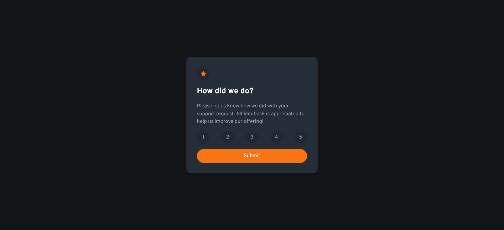

# Frontend Mentor - Interactive rating component solution

## Overview

### The challenge

Users should be able to:

- View the optimal layout for the app depending on their device's screen size
- See hover states for all interactive elements on the page
- Select and submit a number rating
- See the "Thank you" card state after submitting a rating

### Screenshot

### Links

- Solution URL: [Add solution URL here](https://your-solution-url.com)
- Live Site URL: [Add live site URL here](https://your-live-site-url.com)

## My process

### Built with

- Semantic HTML5 markup
- CSS custom properties
- Flexbox
- CSS Grid
- Mobile-first workflow

## Author

- Website - [Shahzaib ur Rehman](https://www.linkedin.com/in/shahzaib-ur-rehman-2518b01b8/)
- Frontend Mentor - [@Shahzaib-ur-Rehman](https://www.frontendmentor.io/profile/Shahzaib-ur-Rehman)